# Panduan Pembangunan Backend Geospasial (Bagian 2)

Selamat Datang! Panduan ini merupakan bagian ketiga dari pembelajaran mengenai pembangunan sebuah fullstack WebGIS sebagai bagian dari mata kuliah Sistem Informasi Geospasial berbasis web di lingkungan Departemen Teknik Geodesi UGM. Materi pada bagian ini akan disampaikan dalam bentuk tutorial praktikum yang disertai dengan sedikit landasan teori.

[toc]


---

## Persiapan Alat dan Bahan

### Instalasi Perangkat Lunak

Untuk mengikuti praktikum ini, berikut adalah beberapa perangkat lunak yang dibutuhkan:

* Instalasi Basisdata **[PostgreSQL](https://www.postgresql.org/download/)** (versi 10>) dan **[PostGIS](https://postgis.net/windows_downloads/)**
* **[Geoserver](http://geoserver.org/release/stable/)**. Untuk latihan ini akan digunakan versi [Jetty](https://sourceforge.net/projects/geoserver/files/GeoServer/2.17.0/geoserver-2.17.0-bin.zip/download) yang lebih mudah diinstall pada Windows.  untuk instalasi yang lebih aman pada pengaturan production, sebaiknya gunakan instalasi [WAR deployment](http://sourceforge.net/projects/geoserver/files/GeoServer/2.17.0/geoserver-2.17.0-war.zip) yang harus dipasang dengan Tomcat. 
* **Text Editor** ([VSCode](https://code.visualstudio.com/download) disarankan untuk keperluan ini)
* **QGIS** untuk berinteraksi dengan data spasial di basisdata PostGIS
* (opsional) **[Apache Tomcat](https://tomcat.apache.org/download-90.cgi)** untuk deployment. Dapat diunduh di [Link Berikut](https://ftp.wayne.edu/apache/tomcat/tomcat-9/v9.0.34/bin/apache-tomcat-9.0.34.exe)
* (opsional) **JAVA JRE/JDK**, diperlukan untuk instalasi Apache Tomcat

**Geoserver** merupakan salah satu perangkat lunak *server data spasial* yang paling banyak digunakan. Geoserver berfungsi untuk menghubungkan antara data spasial pada server dengan client menggunakan protokol terstandarisasi (oleh *OpenGeospatial Consortium/OGC*). Terdapat dua pilihan instalasi Geoserver yang tersedia saat ini, yaitu **platform independent installer** dan ***WebArchive***. Kedua jenis instalasi ini diberikan untuk keleluasaan pengguna. Karena Geoserver dibangun dengan bahasa Java, maka untuk menjalankan Geoserver diperlukan aplikasi servlet container seperti **Jetty** atau **Apache Tomcat**. *Platform Independent Binary* merupakan instalasi Geoserver yang sudah memiliki container servlet sendiri (Jetty) sehingga tidak memerlukan instalasi aplikasi tambahan maupun pengaturan lain dam dapat langsung dijalankan dengan memanggil file **start.jar**. Adapun instalasi *WebArchive* dibuat untuk *deployment* atau instalasi pada server yang sudah memiliki servlet container sendiri sehingga file web archive ini cukup diinstall pada folder yang tersedia.

Untuk kemudahan, praktek berikut akan menggunakan versi *Platform Independent Binary*. Namun demikian, untuk keperluan production (deployment pada server sesungguhnya), disarankan menggunakan web archive yang memiliki lapisan keamanan yang relatif lebih baik.	


Untuk memudahkan praktek bagi yang tidak dapat mengakses pengunduhan Geoserver, dapat digunakan Geoserver pada alamat berikut:

> url				: ```http://geoportal.ppids.ft.ugm.ac.id/geoserver/```
>
> username	: ```admin```
>
> password	: ```geoserver```


### Data untuk praktek

Untuk keperluan praktek dapat dipergunakan data yang terdapat pada [link berikut](https://simpan.ugm.ac.id/s/zPehx9gNk7jmKfG).

Data ini terdiri atas:

- **Shapefile Dataset Sleman**, berisi data batas administratif, curah hujan, dan lain-lain baik dalam bentuk titik, garis maupun luasan dalam format *vector* (shapefile)
- **DEM Sleman**, merupakan data SRTM untuk wilayah sleman dengan resolusi 30 meter
- **Ortofoto UGM**, merupakan hasil foto udara di wilayah UGM tahun 2015

Ketiga data tersebut akan digunakan untuk skenario publikasi data pada server data spasial. Selain data tersebut, boleh juga menggunakan data spasial yang dimiliki sendiri, misalnya dalam format shapefile, DEM atau hasil foto udara.


---

## Server Data Spasial

### Apa itu Server Data Spasial?

Pada pelajaran sebelumnya kita telah berkenalan dengan Apache Webserver. Fungsi dari Apache webserver (yang tercakup dalam paket aplikasi uWAMP) adalah untuk menyajikan file dalam format HTML atau PHP agar dapat diakses melalui domain tertentu (misalnya, *localhost* apabila pengguna mengakses dari komputer itu sendiri). Semua file HTML atau PHP yang disimpan pada folder ***www*** pada direktori uWAMP akan dipublikasikan melalui alamat domain yang dimiliki oleh Apache. 

Dengan demikian, dapat disimpulkan bahwa beberapa fungsi sebuah webserver adalah sebagai berikut:

- Pintu utama untuk akses halaman web yang dipublikasikan oleh pembuat website. 
- Menjalankan dan mengkompilasi *server-side script* seperti aplikasi yang dibuat dengan PHP atau Java
- Lapisan keamanan tambahan, misalnya untuk konfigurasi protokol SSL (HTTPS)
- Pengaturan rute untuk menangani Request dari pengguna sekaligus memberikan Response yang sesuai
- Dan lain sebagainya

Sebuah server data spasial memiliki fungsi yang serupa dengan fungsi sebuah webserver di atas. Apabila pada sebuah webserver dokumen web diolah dan disajikan dalam format HTML, maka server data spasial bertugas untuk menangani bagaimana *data spasial tersebut diolah dan disajikan* pada client dalam sebuah server. 

Berikut adalah beberapa tugas dari sebuah server data spasial:

- Memastikan data dari berbagai format data spasial yang berbeda dapat diakses oleh client 
- Memastikan data spasial dengan berbagai sistem proyeksi dapat diakses oleh client
- Memberikan simbologi untuk data spasial yang akan dimunculkan pada peta oleh client
- Memberikan akses pada data atribut dan geometry dari data spasial pada server sesuai dengan standar yang berlaku
- Memastikan bahwa data spasial dalam ukuran yang besar dapat diakses dengan mudah oleh client

Dapat disimpulkan bahwa server data spasial bertugas untuk menangani penyajian data spasial yang tersimpan di server agar pengguna/client dapat mengakses data tersebut melalui jaringan internet.

### Layanan (Services) berstandar OGC

Sebelumnya telah dijelaskan bahwa untuk menyajikan data spasial di internet dapat dilakukan dengan menggunakan standar tertentu. Dalam hal penyajian data spasial di internet, terdapat lembaga yang bertugas untuk memberikan standar penyajian data agar dapat diakses oleh client. OpenGeospatial Consortium (OGC) memberikan standar rinci mengenai bagaimana data spasial dapat diakses menggunakan protokol pertukaran data yang dikenal dengan nama layanan geospasial (*geospatial web services*). 

Beberapa standar OGC yang perlu dikenal antara lain:

- **WMS** (*Web Map Service*), untuk menyajikan data raster maupun vector menjadi format raster. Biasanya digunakan untuk menyajikan layer yang tidak memerlukan banyak analisis spasial pada sebuah webGIS
- **WFS** (*Web Feature Service*), untuk menyajikan data vector agar dapat diakses atribut serta geometrynya. Biasanya digunakan untuk melakukan analisis spasial di sisi client
- **WCS** (*Web Coverage Service*), untuk menyajikan data raster dengan tetap menyajikan nilai Digital Number tiap pixelnya. Biasanya digunakan untuk memberikan kemampuan analisis spasial berbasis raster pada sisi client (misalnya *aspect* dan *slope*)
- **CSW** (*Catalog Service Web*) Digunakan untuk menyajikan metadata sebuah halaman web. Melalui standar CSW inilah sebuah geoportal pada **Infrastruktur Informasi Geospasial** dapat diwujudkan

Pembahasan lebih jauh mengenai jenis-jenis layanan OGC akan diberikan pada perkuliahan yang lain, atau dapat dilihat pada [slide berikut](https://simpan.ugm.ac.id/s/r9kuc7wSXxZBf8z).


### Arsitektur WebGIS dengan Server Data Spasial

Berdasarkan apa yang sudah kita pelajari dari materi perkuliahan SIG berbasis Web dan materi yang akan dipelajari pada bagian ini, dapat disimpulkan bahwa terdapat beberapa model Arsitektur WebGIS terkait dengan hubungan client dan server, antara lain:

1. Arsitektur WebGIS dengan pendekatan client-side saja

   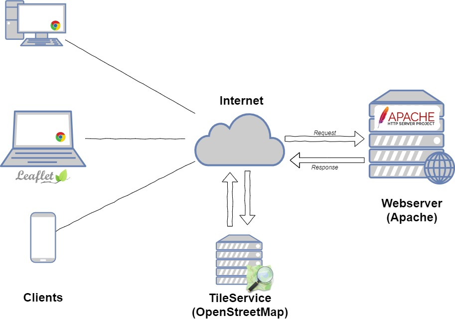

   

2. Arsitektur WebGIS dengan pendekatan client-side saja

   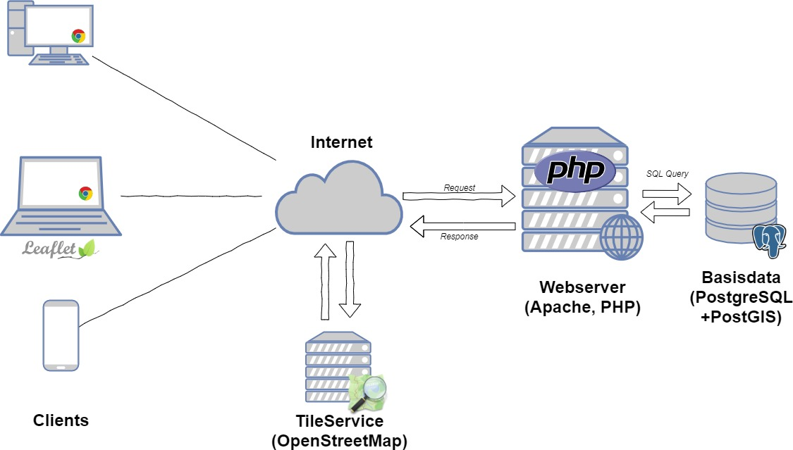

3. Arsitektur WebGIS dengan pendekatan client-side saja

   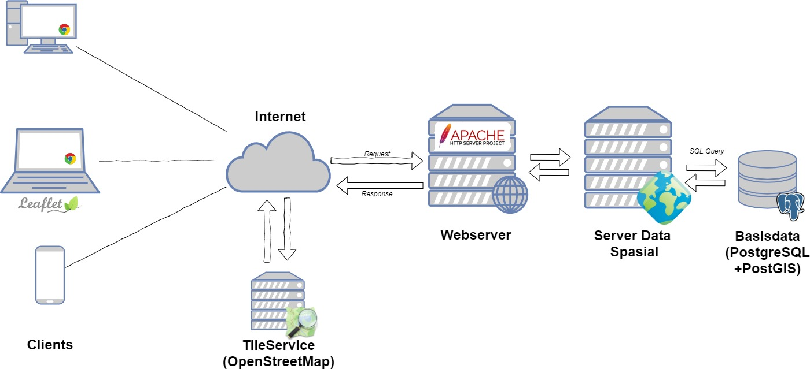

4. Arsitektur WebGIS dengan pendekatan client-side saja

   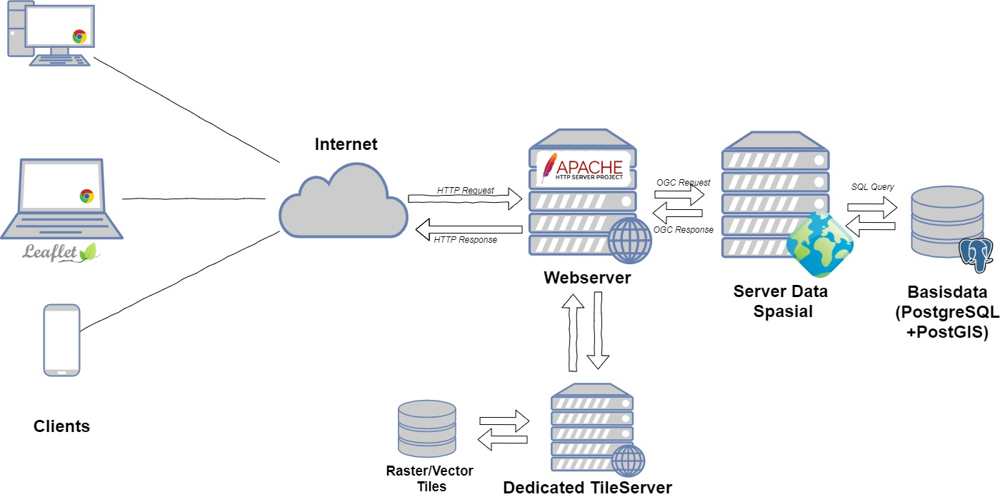

Masing-masing model memiliki tingkat kompleksitas, waktu pengerjaan dan kebutuhan server yang berbeda. Setiap arsitektur webGIS di atas dapat diterapkan sesuai dengan kebutuhan pengguna. Boleh jadi pengguna hanya membutuhkan webgis untuk tampilan beberapa titik di peta. Untuk kondisi tersebut, developer web dapat memilih opsi model arsitektur webGIS pertama, yaitu cukup menggunakan LeafletJS di sisi client dengan data yang disimpan pada file GeoJSON.

Oleh karena itu, pada saat pembangunan sebuah sistem webGIS diperlukan kajian menyeluruh mengenai kebutuhan pengguna (*user requirements*). Pembahasan mengenai hal ini akan diberikan pada kuliah selanjutnya.

---

## Geoserver

### Memanggil dan menjalankan Geoserver

Sebagaimana dijelaskan sebelumnya, Geoserver merupakan aplikasi berbasis Java yang memerlukan container untuk dapat dijalankan di server. Untuk latihan ini diasumsikan Geoserver diinstall menggunakan **Platform Independent Binary**, sehingga tidak memerlukan container khusus.

> ***Latihan 1: Menjalankan Geoserver***
>
> Setelah mengunduh Geoserver (versi stabil terbaru saat ini adalah versi 17), lakukan ekstraksi file **zip** yang diperoleh pada folder manapun (tidak harus diletakkan di folder khusus). Hasil ekstraksi adalah sebagai berikut:
>
> 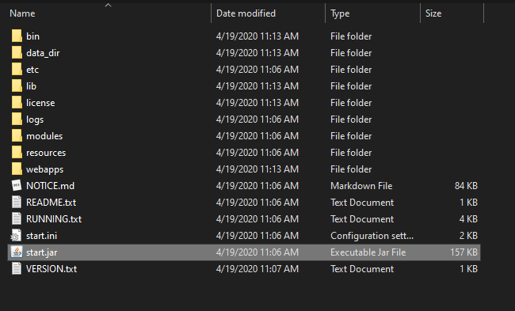
>
> Berbagai file di atas adalah aplikasi Geoserver berikut dengan container yang digunakan untuk menjalankannya (Jetty). Oleh karena itu, Geoserver dapat langsung dijalankan melalui file **start.jar**. Klik dua kali pada file tersebut untuk memulai Geoserver.
>
> Setelah dijalankan, container Jetty akan menggunakan port 8080 (default) untuk menjalankan aplikasi servlet yang terinstall. Untuk itu, buka alamat *http://localhost:8080/geoserver* pada browser untuk membuka aplikasi Geoserver.
>
> 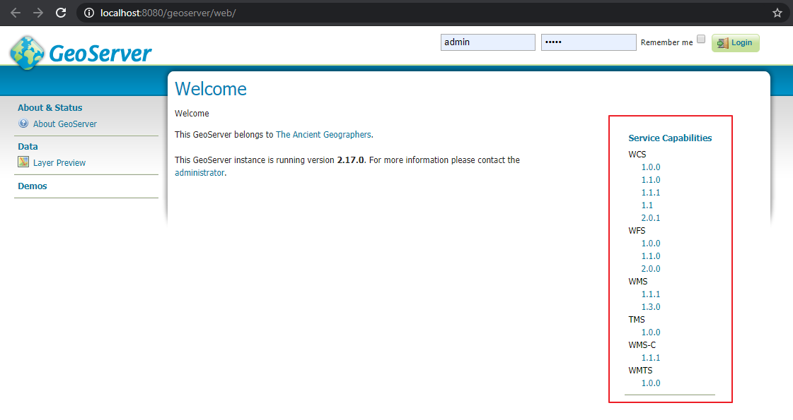
>
> Gambar di atas menunjukkan tampilan awal Geoserver ketika di buka. Pada bagian kanan terdapat keterangan mengenai ***Server Capabilities***. Beberapa menu yang tersedia menunjukkan layanan OGC yang didukung oleh Geoserver ini. Terdapat beberapa versi yang didukung sesuai dengan standar OGC yang selalu mengalami pembaruan.
>
> Untuk masuk ke dalam Geoserver sebagai administrator, gunakan *username* dan *password* default sebagai berikut:
>
> ​	**Username**: 	```admin```
>
> ​	**Password**:	```geoserver```
>
> Setelah masuk sebagai admin, menu yang muncul akan bertambah. Seorang admin dapat menambahkan data baru, mengatur layanan (*service*), membuat tiling, mengatur keamanan, dan lain sebagainya. Tampilan setelah login sebagai admin adalah sebagai berikut:
>
> 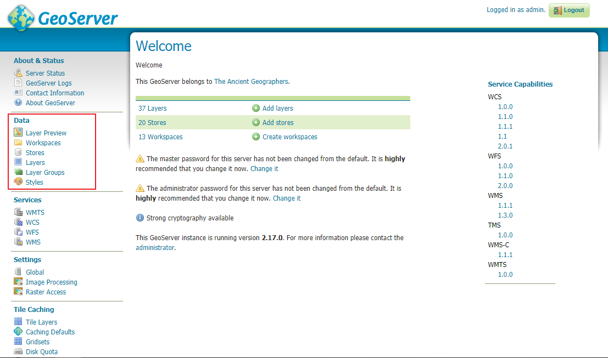
>
> ​	Bagian yang ditandai berwarna merah di atas merupakan menu utama untuk publikasi data spasial, seperti data dalam format shp maupun dari basisdata PostGIS. Bagian selanjutnya akan membahas mengenai cara publikasi data spasial dari format *shp* maupun dari basisdata PostGIS menjadi layanan berstandar OGC.
>
> Pada bagian **Data** di sebelah kiri halaman, klik pada menu ***Layer Preview***. Halaman Geoserver akan menampilkan seluruh data spasial yang tersimpan pada Geoserver dan dipublikasikan sebagai layanan OGC. Pada instalasi Geoserver baru, daftar ini hanya akan berisi beberapa layer demo yang disediakan oleh Geoserver sendiri. 
>
> 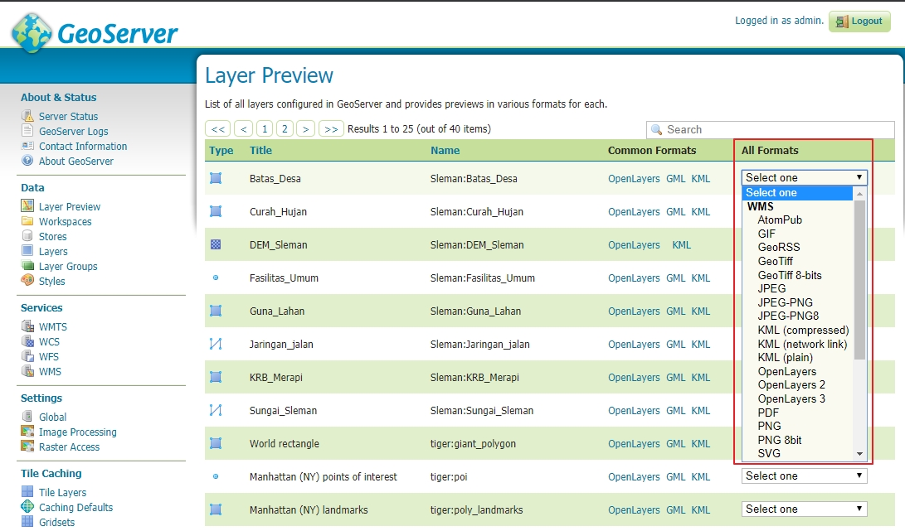
>
> Pada bagian kanan dari halaman Layer Preview, terdapat beberapa opsi layanan OGC yang dapat dipanggil, misalnya dalam format WMS atau WFS. Pada bagian WMS dari salah satu layer (layer apa saja), klik pada format PNG untuk membuka tampilan berikut:
>
> 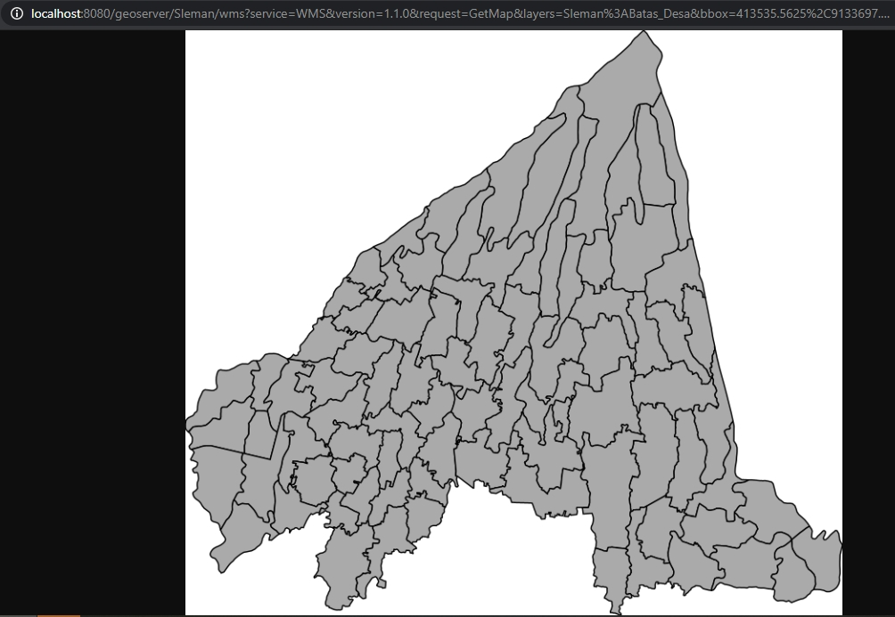
>
> Tampilan tersebut adalah peta dalam format vector yang dipanggil menggunakan protokol WMS. Coba buka layer yang sama dengan protokol yang berbeda (misalnya WFS), dan lihat perbedaannya.


### Publikasi data shapefile

Sebagai seorang developer WebGIS, tujuan utama pembuatan sebuah webGIS adalah agar data spasial yang kita miliki dapat dipublikasikan melalui internet dan dapat diakses oleh pengguna website. Di kuliah sebelumnya telah dibahas mengenai bagaimana mengkonversi file SHP menjadi GeoJSON untuk dipanggil pada LeafletJS sehingga dapat dimunculkan dalam bentuk WebGIS interaktif dengan pendekatan client-side scripting tanpa menggunakan basisdata khusus. Kemudian, sebelumnya juga dibahas bagaimana data spasial yang disimpan pada sebuah basisdata (misalnya PostGIS) dapat diakses secara langsung oleh LeafletJS melalui server-side scripting seperti PHP. Pada bagian ini akan dibahas mengenai bagaimana menggunakan Geoserver untuk mempublikasi data-data spasial, khususnya dari format shapefile.

> **Pertanyaan**: *Mengapa harus menggunakan layanan berstandar OGC untuk publikasi data spasial?*

Sebelum memulai latihan, terlebih dahulu unduh data shapefile dari [link yang telah diberikan di atas](https://simpan.ugm.ac.id/s/zPehx9gNk7jmKfG). Untuk latihan ini hanya akan digunakan data Batas Administrasi Kabupaten Sleman saja.

> ***Latihan 2: Publikasi data shapefile dengan Geoserver***
>
> Buka Geoserver sebagai admin, kemudian perhatikan menu **Data** pada bagian kiri halaman
>
> 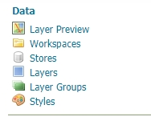
>
> Urutan untuk publikasi data dapat dilihat sesuai dengan urutan tersebut, yaitu:
>
> **1) Workspace**, yaitu membuat project yang nantinya akan berisi data-data spasial. Workspace dapat dianalogikan sebagai project (misal WebGIS Sleman), dimana masing-masing workspace dapat berisi lebih dari satu layer.
>
> **2) Stores**, merupakan penghubung antara Geoserver dengan data spasial yang tersimpan di server, baik dalam format flatfile (seperti shapefile atau Geotiff) maupun yang tersimpan dalam basisdata seperti PostGIS.
>
> **3) Layers** mengatur individu layer pada Geoserver, terkait dengan publikasi, simbologi, sistem proyeksi, dan lain sebagainya
>
> **4) Layer Group** apabila beberapa layer akan dikumpulkan menjadi satu, misalnya untuk keperluan query atribut dari beberapa layer sekaligus
>
> Langkah pertama adalah membuat workspace untuk menyimpan beberapa data spasial yang akan diunggah ke dalam Geoserver. Langkah ini dapat diabaikan apabila workspace yang diinginkan sudah tersedia dan hanya diperlukan untuk mengunggah layer baru ke workspace yang sudah ada.
>
> 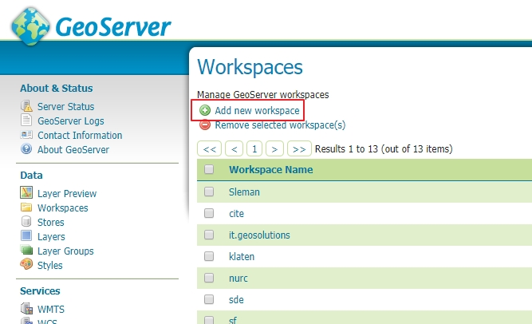
>
> Di halaman Workspace, Klik pada tombol ***Add new workspace***. 
>
> 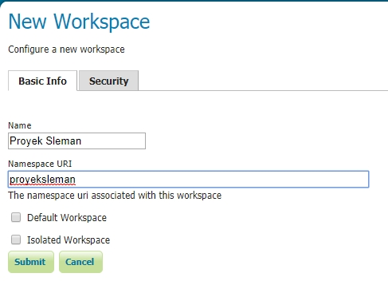
>
> Isikan nama workspace dan namespacenya. Perhatikan bahwa nama pada bagian *name* tidak boleh mengandung spasi. Adapun *Namespace* mewakili nama workspace yang nanti akan digunakan pada pemanggilan layernya. Kemudian, klik ***Submit***. 
>
> Setelah workspace dibuat, selanjutnya adalah melakukan koneksi data melalui **data store**.
>
> 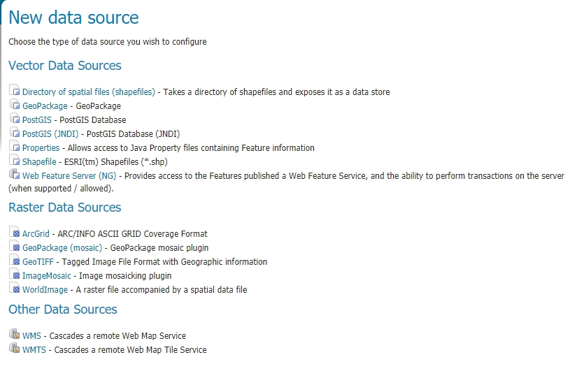
>
> Terdapat tiga macam sumber data yang dapat dipublikasi oleh Geoserver, yaitu vector, raster, serta cascading service (perpanjangan dari server lain). Untuk latihan ini akan diunggah beberapa shapefile sekaligus, yaitu **Sleman Dataset** dari data latihan. Untuk itu, digunakan pilihan **Directory of Spatial Files (Shapefiles)**. Arahkan ke folder tempat penyimpanan shapefile (yang sudah diekstrak dari file zip), kemudian Geoserver akan mendaftar layer yang ada pada folder tersebut.
>
> 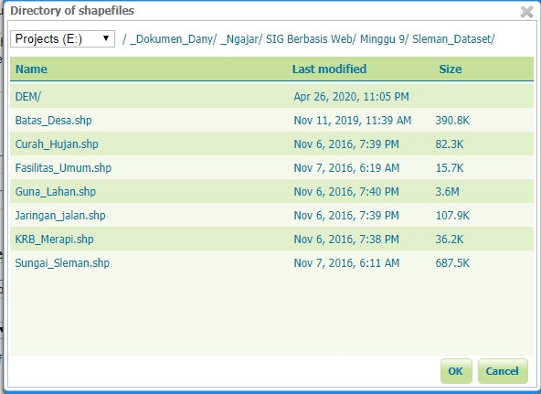
>
> Sebelum dipublikasi, layer pada Geoserver tidak akan dapat dilihat oleh orang lain selain administrator. Untuk itu, agar layer dapat diakses dan dipublikasikan dalam standar OGC. Untuk mempublikasikan layer **Batas Desa**, klik pada link **Publish** di sebelahnya.
>
> 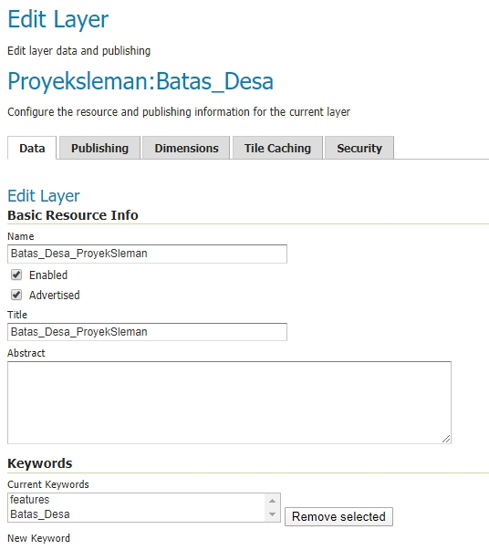
>
> Pada jendela **Edit Layer** yang muncul, berikan nama yang mudah dikenali pada layer tersebut. pastikan bahwa layer tersimpan pada workspace yang benar. Selanjutnya, atur sistem referensi pada layer tersebut.
>
> 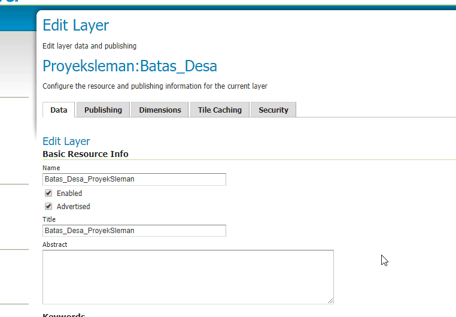
>
> Pengaturan sistem referensi (CRS) pada layer di Geoserver terbagi menjadi 2 macam:
>
> - **Native CRS**: sistem proyeksi yang diidentifikasi oleh Geoserver secara otomatis dari data
> - **Declared CRS**: Sistem proyeksi yang kita (admin) pilih untuk diterapkan pada layer yang dipublikasi
>
> Untuk menangani kedua sistem tersebut, terdapat tiga opsi:
>
> - **Force Declared**, apabila diinginkan agar CRS native diabaikan dan digunakan CRS declared saja
> - **Reproject Native to Declared**, apabila perlu dilakukan transformasi proyeksi terlebih dahulu dari native ke declared
> - **Keep Native**, apabila Declared diabaikan dan data dipublikasi sebagaimana kondisi aslinya.
>
> Hitungan Bounding Box diperlukan oleh Geoserver agar dapat memberikan posisi layer yang jelas pada saat pemanggilan layer melalui KVP (*Key-Value Pair*). Untuk itu, bounding Box perlu dihitung dari data (Native Bounding Box) serta Bounding Box publikasi yang menggunakan sistem EPSG:4326. Gunakan masing-masing tombol **Compute from data** dan **Compute from Native Bound** untuk mengisi koordinat tersebut secara otomatis.
>
> Setelah pengaturan selesai dilakukan dan tombol ***Save*** ditekan, selanjutnya periksa pada Halaman ***Layer Preview*** untuk melihat apakah layer telah dipublikasikan oleh Geoserver.
>
> 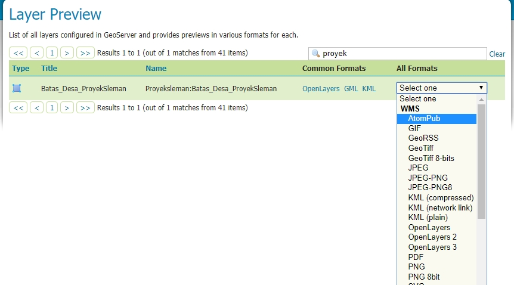


### Publikasi data dari basisdata PostGIS

Publikasi data dari basisdata dapat dilakukan dengan cara yang sama seperti pada saat publikasi data dari shapefile, yaitu dengan membuat ***data store*** baru untuk koneksi ke data dari Geoserver. Perbedaannya terletak pada data store yang dipilih, yaitu menggunakan koneksi PostGIS.

Adapun parameter yang perlu dimasukkan untuk koneksi ke basisdata PostGIS sama seperti pelajaran minggu lalu, yaitu:

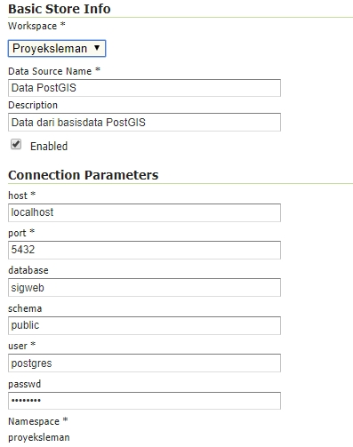

**Host** : alamat server tempat PostGIS berada. Gunakan '*localhost* 'apabila terletak pada server yang sama

**Port**: Port yang digunakan oleh PostGIS (default: 5432)

**Database**: Basisdata spasial yang dituju (berisi data spasial yang sudah ditambahkan ke PostGIS)

**User dan Password** : Username dan password untuk koneksi ke PostgreSQL. default: *postgres* dan *postgres*

---

## Memanggil data dari server data spasial

### Memanggil data dari QGIS

QGIS memiliki menu khusus untuk pemanggilan layer yang dipublikasi dengan standar OGC melalui Data Source Manager. Standar yang didukung antara lain WMS/WMTS, WFS dan WCS. Standar lain seperti CSW untuk katalog service dapat dipanggil dengan menggunakan plugin tambahan.

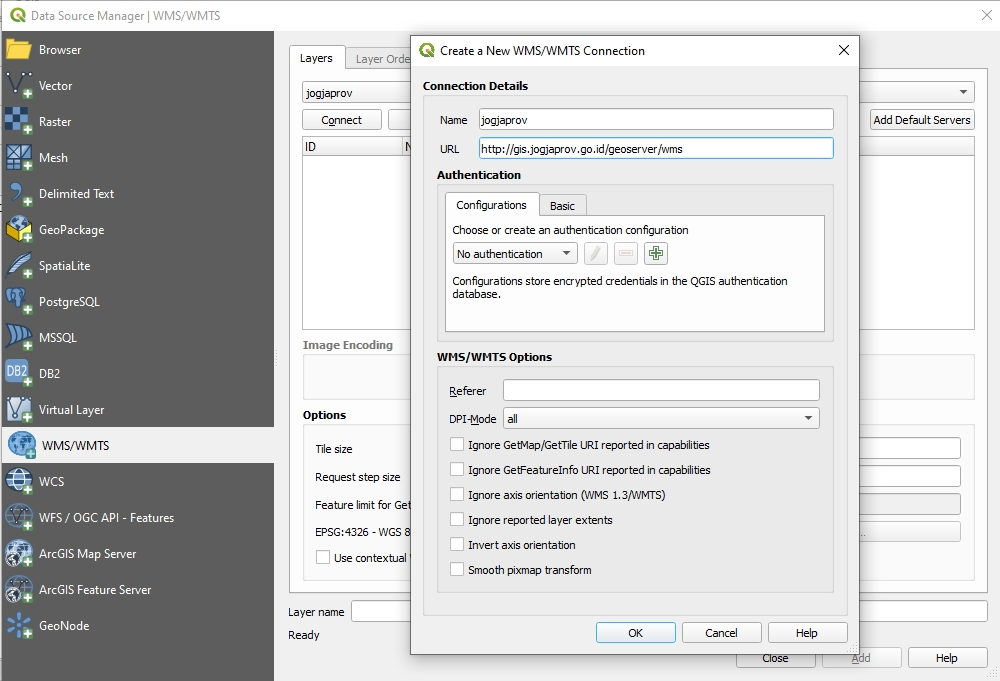

Pada gambar di atas, koneksi pada layer WMS dapat dilakukan dengan memasukkan parameter url dari alamat geoserver yang dituju, kemudian secara otomatis QGIS akan mendaftar layer yang tersedia pada server tersebut sehingga dapat dipilih dan ditambahkan ke kanvas QGIS sebagai salah satu layer.


### Memanggil WMS dari LeafletJS	

Untuk memanggil layer WMS dari LeafletJS dapat dilakukan dengan menggunakan fungsi bawaan pada LeafletJS sebagai berikut:

```javascript
var slemanWMS = L.tileLayer.wms('http://localhost:8080/geoserver/wms', {
    layers: 'Sleman:Batas_Sleman'
}).addTo(map);
```

Panduan lengkapnya dapat dilihat pada [link berikut](https://leafletjs.com/examples/wms/wms.html).


---

## Penyajian Data Raster

Bab ini akan dibahas pada bagian lain

### Konsep Tiling data Raster

### Geowebcache

### Membuat tile dengan QGIS 

### Cloud-Optimized GeoTIFF

### Vector Tiles


---

## Pertanyaan dan Latihan

1. Dalam kasus apa saja sebaiknya digunakan model webGIS yang menggunakan metode:
   	- Client-side only (dengan LeafletJS atau OpenLayers)
   - Server-side dengan basisdata spasial
   - Server side dengan basisdata spasial dan server data spasial
   - Server-side dengan menggunakan tiling service dengan/tanpa basisdata spasial
2. Apa keuntungan menyimpan data pada basisdata (semisal PostGIS) sebelum memanggilnya sebagai layer pada Geoserver, dibandingkan dengan memanggil data SHP secara langsung?
3. Bagaimana memanggil layanan standar OGC selain WMS dan WMTS pada LeafletJS?


---

## Rujukan

[Leaflet WMS dan TMS](https://leafletjs.com/examples/wms/wms.html)

[Vector Tiles](https://docs.mapbox.com/vector-tiles/specification/)

[Cloud Optimized Geotiff](https://medium.com/planet-stories/a-handy-introduction-to-cloud-optimized-geotiffs-1f2c9e716ec3)


